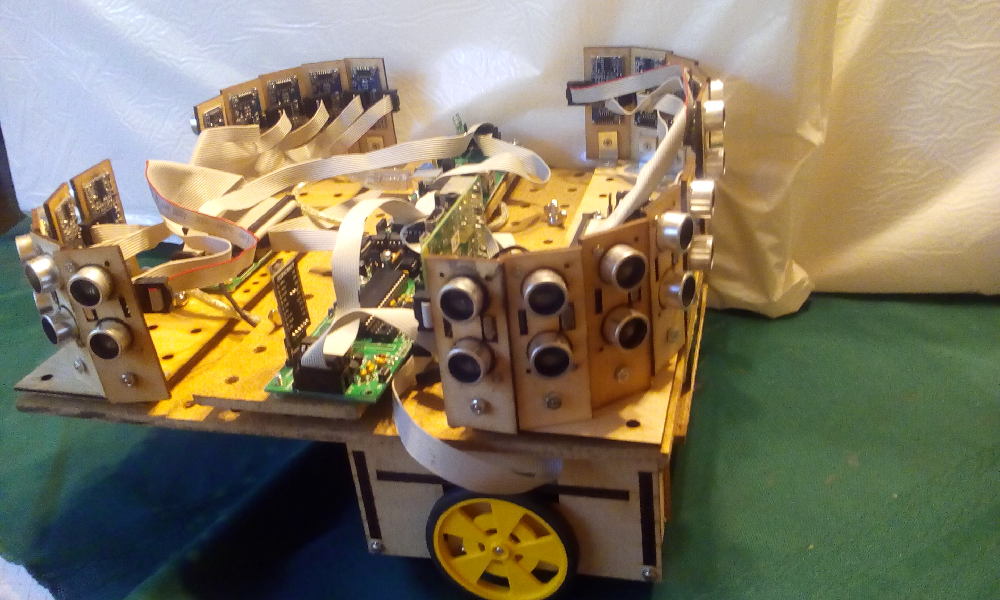

# bus_freya

This repository contains the documentation and code for the
Freya robot.

<BlockQuote>

</BlockQuote>

## Introduction

Freya is a small "hackable" robot that is intended to run
ROS (Robot Operating System.)  ROS runs on a Raspberry Pi 2
computer board.  All of the remaining electronics on Freya
are modularized into 50mm x 100mm PCB's that connected
together via a bus.  Freya has two motors/wheels/encoders
and 20 sonars.  All printed circuit boards use through hole
parts for easy assembly by people that are relatively new
to soldering.

## Specifications:

* Main Processor: Raspberry Pi 2 (900MHz Quad Core ARM A7 w/1GB RAM)

* Dimensions: 300mm (L) x 300mm (W) x ~200mm (H)

* Battery: 20000mAH Lithium-Ion Battery Pack

* Sonars: 20 HC-SR04 sonars

* Motors: Solarbotics GM3 Gearmotors

* Wheels: 67mm (D) x 10mm (W)

* Encoders: .95 ticks/mm

* Speed: .5 M/Sec

* Camera: Upward pointing Raspberry Pi Camera (2592 x 1944 pixels)

* Subsidiary Boards:

  * bus_raspberry_pi: Connects to Raspberry Pi 2 board via
    2x40 pin connector.  Uses an Atmel ATmega324P processor
    to interface between Raspberry Pi 2 and bus.

  * bus_power: Routes power between battery pack and remaingi
    motors.

  * bus_bridge_encoders_sonar: Provides drive and encoder
    electronics for two motors/encoders.  The sonar function
    is not used.

  * bus_sonar 10: Each of these boards can manage up to 10
    HC-SR04 sonars.  There are 2 of these boards on Freya.

